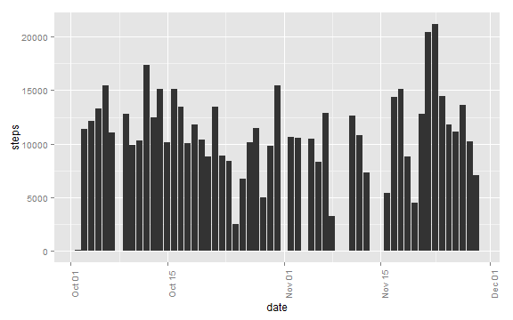
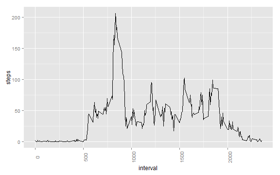
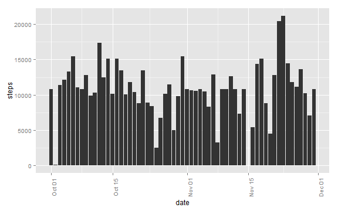
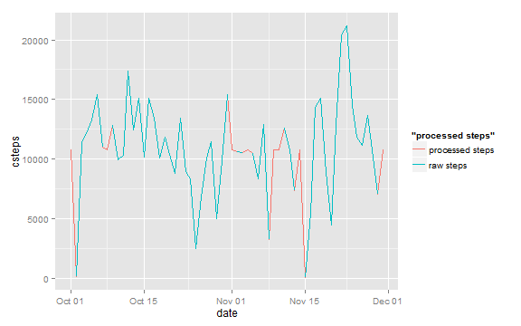
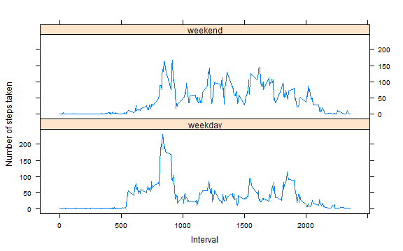

Analysis of activity monitoring data
========================================================

The purpose of this assignment is to clean up and analyze the activity monitoring data collected from a monitoring device.  This device monitors and records the number of steps the subject has taken while wearing the monitoring device.  This experiment was conducted over a few weeks and the number of steps taken were recorded every 5 minutes over the course of these days. Observations recorded are as follows

* **steps:** Number of steps taken by the subject
* **date:** Date on which data was recorded
* **interval:** 5 minute interval identified by the offset in minutes from the hour
  
  
This data can be downloaded from [here.](https://d396qusza40orc.cloudfront.net/repdata%2Fdata%2Factivity.zip) Quick look at the data suggests that for some dates the data is not available and is recorded as **'NA'**.  For some other days the total number of steps taken is impractically low if not zero.  For the purpose of this report these non NA values are taken as they are. 
  
  
This analysis tries to address a few specific question with appropriate plots that are pertinent to the questions.  For the purposes of knitting the data is expected to be in the current working directory with the name **activity.csv** in a CSV format

This report is segmented based on the questions posed in the assignments.  Description from the assignment are shown here verbatim as quoted.

----
>Show any code that is needed to  
>Load the data (i.e. read.csv())  
>Process/transform the data (if necessary) into a format suitable for your analysis  

Following code chunk sets up the data required for generating the plots and data required for this report. To make the report clean,  all the error messages from the R code chunks are suppressed 


```r
# load required packages
require(ggplot2)
require(lattice)

# Load the file reading in the 
setAs("character","myDate", function(from) as.Date(from, format="%Y-%m-%d") )
rdata = read.csv("activity.csv", colClasses=c("numeric", "myDate", "numeric"))

# Make a histogram of total number of steps taken a day
# Make a histogram of total number of steps taken a day
raggr_by_date = aggregate(steps ~ date, rdata, sum)
```

----
>#### What is mean total number of steps taken per day?
>For this part of the assignment, you can ignore the missing values in the dataset.  
>Make a histogram of the total number of steps taken each day  
>Calculate and report the mean and median total number of steps taken per day  


The Following plot depicts the total number of steps taken by the subject per day in the form of histograms


```r
qp1 = qplot(date, steps, data=raggr_by_date, geom="histogram", stat="identity")
qp1 = qp1 + theme(axis.text.x=element_text(angle=90))
qp1
```

 

Mean and median of the total number of steps taken by the subject a day across all the days are as follows  
**Mean:** 1.0766 &times; 10<sup>4</sup>  
**Median:** 1.0765 &times; 10<sup>4</sup>  
For the purpose of the above calculation NA values are ignored  

----

> #### What is the average daily activity pattern?  
>Make a time series plot (i.e. type = "l") of the 5-minute interval (x-axis) and the average number of steps taken, averaged across all days (y-axis)  
>Which 5-minute interval, on average across all the days in the dataset, contains the maximum number of steps?  


```r
# time series plot of average steps taken in a given 5 minute interval averaged over
# the days
raggr_by_interval = aggregate(steps ~ interval, data=rdata, FUN=mean)
ggplot(raggr_by_interval, aes(interval, steps)) + geom_line() + theme(axis.text.x=element_text(angle=90))
```

 

Interval where maximum number of steps is taken as computed is **835**  
The plot above is inline with the result computed when inspected visually

----

>#### Imputing missing values
>Note that there are a number of days/intervals where there are missing values (coded as NA). The presence of missing days may introduce bias into some calculations or summaries of the data.  
>Calculate and report the total number of missing values in the dataset (i.e. the total number of rows with NAs)  
>Devise a strategy for filling in all of the missing values in the dataset. The strategy does not need to be sophisticated. For example, you could use the mean/median for that day, or the mean for that 5-minute interval, etc.  
>Create a new dataset that is equal to the original dataset but with the missing data filled in.  
>Make a histogram of the total number of steps taken each day and Calculate and report the mean and median total number of steps taken per day. Do these values differ from the estimates from the first part of the assignment? What is the impact of imputing missing data on the estimates of the total daily number of steps?  

Total number of the values missing in the given data set is **2304**  

To fill in the missing values, average value of steps taken over all the days for all the intervals in the day.  If the data is missing for any particular interval on a given day,  average number of steps taken for that interval across all the days


```r
# create a new data frame with missing values substituted by the average number
# of steps taken in that 5 minute period across all days
cdata = rdata
caggr_by_interval = aggregate(steps ~ interval, cdata, mean)

fn = function(x) {
  if (is.na(x[[1]])) {
    newval = caggr_by_interval$steps[caggr_by_interval$interval == as.numeric(x[[3]])]
  } else {
    newval = x[[1]]
  }
  newval
}
csteps = as.numeric(apply(rdata, 1, fn))
cdata$steps = csteps

# Make a histogram of total number of steps taken a day
caggr_by_date = aggregate(steps ~ date, cdata, sum)

# show only limited number of ticks and orient the tick labels vertically
qp2 = qplot(date, steps, data=caggr_by_date, geom="histogram", stat="identity")
qp2 = qp2 + theme(axis.text.x=element_text(angle=90))
qp2
```

 

To evaluate the effect of imputing values, following plot shows the time series plots of average number of steps taken for the raw data as well as the data set that has been cleaned


```r
# for comparison draw a line plot that shows both plots
# knit a new data frame from both aggregates
taggr = caggr_by_date
names(taggr) = c("date", "csteps")
xaggr = merge(taggr, raggr_by_date, by = 'date', all.x=TRUE)

ggplot(xaggr, aes(date)) + 
  geom_line(aes(y = csteps, colour = "processed steps")) + 
  geom_line(aes(y = steps, colour = "raw steps"))
```

```
## Warning: Removed 2 rows containing missing values (geom_path).
```

 

Above plot indicates that imputing values this way actually fills the gaps in the plot and does not the skew results too much

Mean and median of the total number of steps taken by the subject a day across all the days are as follows  
**Mean:** 1.0766 &times; 10<sup>4</sup>  
**Median:** 1.0766 &times; 10<sup>4</sup>  

----


```r
# assign two factors weekend and weekday depending on the day of the activity
wdata = cdata
fn = function(x) {
  wdays = weekdays(as.Date(x[[2]]))
  if (wdays == "Saturday" | wdays == "Sunday") {
    "weekend"
  } else {
    "weekday"
  }
}
wdays = apply(wdata, 1, fn)
wdata$wdays = as.factor(wdays)

require(lattice)
waggr = aggregate(steps ~ interval+wdays, wdata, mean)
xyplot(steps~interval|wdays, data=waggr, type="l", xlab="Interval", ylab="Number of steps taken", layout=c(1,2))
```

 


